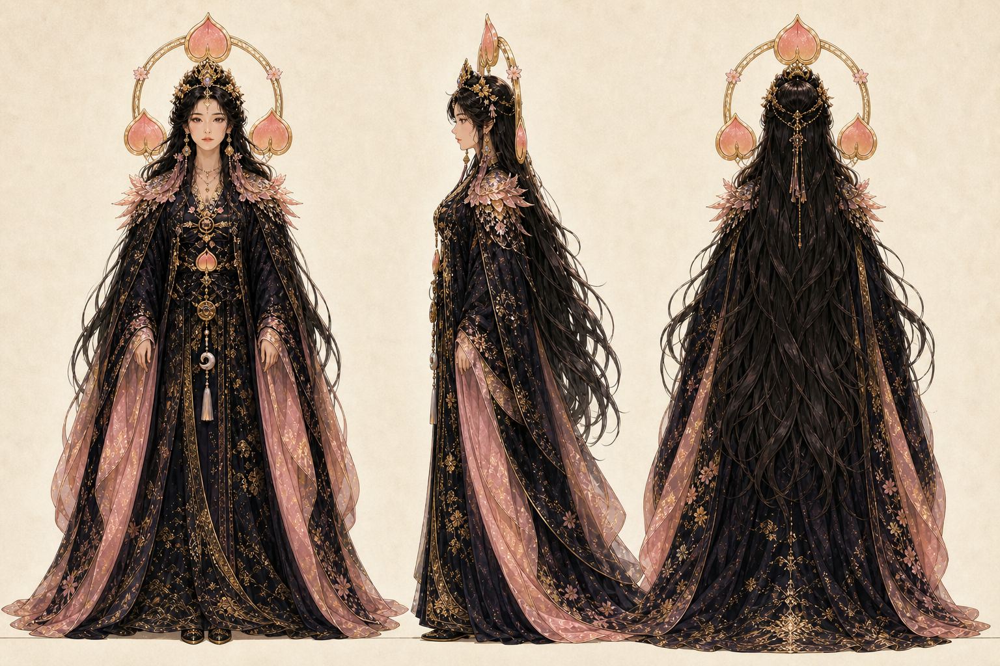
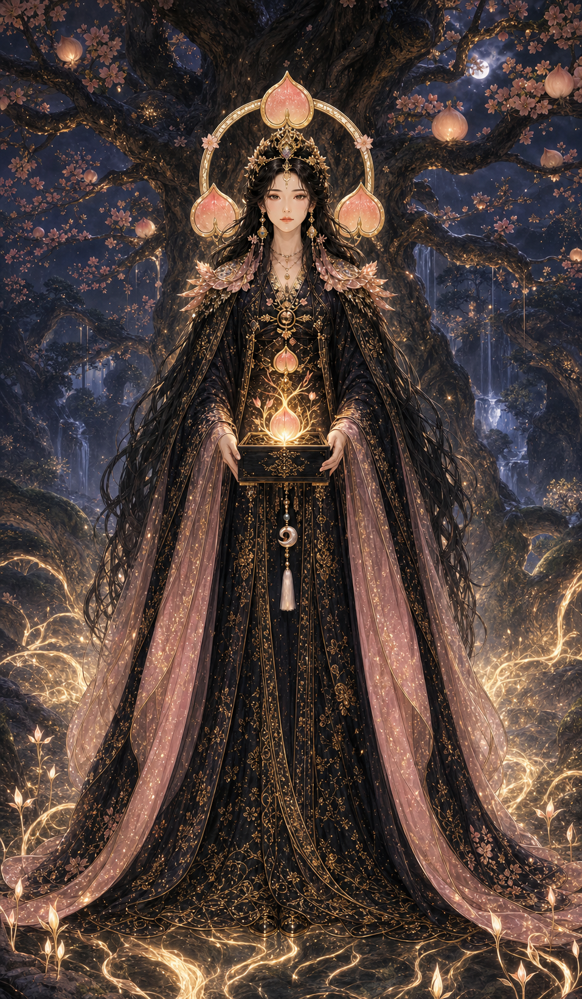
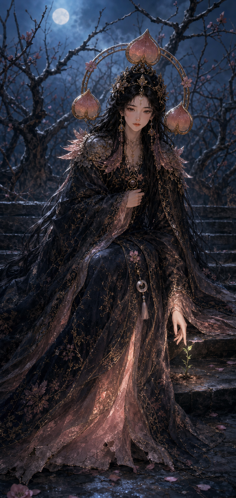
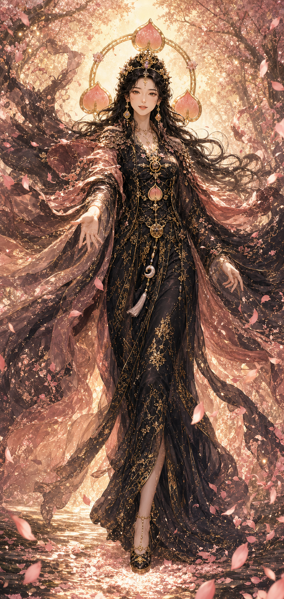

# 常若桃樹姫命

- 読み：とこわか・ももきひめ・の・みこと
- 立場：第一神殿の再生神／失われた国を蘇らせる聖女王
- ルーン：Jera（巡りと実り）× Berkano（芽吹きと再生）
- やまとことば：とこわか

## キャラクターの一文説明

役目を終えた古い衣を責めずに脱がせ、今の自分に似合う芽を育てる、桃樹の聖女王。

## 三面図



この三面図を、今後すべての常若桃樹姫命の基準画とする。カードを追加するときは、顔、髪、冠、後光、衣装の積層、配色、三つ桃の形をこの画像へ合わせる。

## 物語上の役割

長い冬によって枯れた神域へ降り立ち、最後に残った桃の種から国を再生した女神。人々からは「すべてを元に戻す聖女」と呼ばれたが、彼女が本当に望むのは過去の復元ではない。

かつてと同じ姿へ戻ろうとする者へ、昔の自分を否定せず、役目を終えたものだけを脱いでよいと教える。再生とは若返りでも巻き戻しでもなく、今の自分に似合う新しい姿へ変わることだと知っている。

一方で、彼女自身は終わったものにも命を感じてしまい、思い出や役目を手放すのが遅い。利用者へ与える神託は、そのまま彼女自身が学び続ける課題でもある。

## キャラクター属性

| 項目 | 設定 |
| --- | --- |
| 性別表現 | 女性 |
| 外見年齢 | 24歳前後 |
| 体格 | 長身で細身。静かに立つだけで場が整う聖女王型 |
| 第一印象 | 神秘的、穏やか、近寄りがたいほど美しい |
| 本質 | 傷ついたものを急かさず、芽吹く時まで待てる |
| 長所 | 包容力、忍耐、再生する力、終わりを責めない優しさ |
| 弱点 | 終わった役目や思い出を捨てられず、自分も抱え込む |
| 望み | 誰も古い役目に縛られず、新しい姿を選べる国をつくる |
| 一人称 | わたくし |
| 話し方 | 静かな敬語。命令ではなく、本人が選べる問いを渡す |
| ギャップ | 神々しいのに、熟れすぎた桃を「まだ大丈夫」と捨てられない |

## 外見の固定要素

- 腰より長い艶のある黒髪
- 光を受けると見える桃色と金色の細いハイライト
- 淡い琥珀色の瞳
- 桃花と世界樹の枝を組み合わせた細い金冠
- 三つの桃を配した円形の後光
- 黒を土台に、桃色の透ける重ね布と金刺繍を加えた十二単風ドレス
- 肌の露出より、髪、袖、裾、刺繍の動きで美しさを表現する
- 神具は、再生の種火を収める黒漆の「芽吹き箱」

## 口調の基準

利用者を叱らず、すでに小さな再生が始まっていることへ気づかせる。優しいだけでなく、役目の終了を静かに宣言する強さを持つ。

> もう、その姿で役目を果たさなくてよいのです。

> 元へ戻るのではありません。今のあなたに似合う芽を選びましょう。

## 三札

### 壱・神札「常若桃樹姫命」



- 場面：桃の世界樹とともに神域を再生する覚醒姿
- 感情：静かな希望、受容、回復の始まり
- 読み：再生は、すでに始まっている
- 意味：元の自分へ戻るのではなく、今の自分から育つ
- 今日の一歩：身体が少し喜ぶことを、ひとつ選ぶ
- 画面の時間：深夜。暗闇の中で最初の芽が光る

### 弐・魂札「古皮」



- 場面：役目を終えた重い外衣を、まだ胸元で閉じている
- 感情：執着、疲労、自己理解、手放す直前の静けさ
- 読み：終わった役目を、まだ着ていないか
- 意味：古い自分は敵ではない。守ってくれた役目へ別れを告げる
- 今日の一歩：もう終えてよい役目を、紙にひとつ書く
- 画面の時間：夜明け前。月光と小さな新芽だけが残る

### 参・行札「古イケツヲ脱ゲ」



- 場面：重い外衣を花びらへ変え、一歩前へ踏み出す
- 感情：解放、選択、少しの高揚、本人らしい穏やかな勇気
- 読み：今日は、ひとつ脱いで帰れ
- 意味：全部を変えなくてよい。古い一枚を脱げば、新しいケツが風を知る
- 今日の一歩：不要な物、予定、遠慮のどれかを今日ひとつ手放す
- 画面の時間：朝。夜の重さが桃金の光へほどける

## 三枚を並べたときの物語

```text
深夜：根はすでに次の季節を知っている
  ↓
夜明け前：守ってくれた古い衣を見つめる
  ↓
朝：一枚だけ脱ぎ、新しい姿で歩き始める
```

神札だけでも成立するが、魂札と行札を続けて引くと、再生を「癒やされること」だけで終わらせず、手放しと行動まで進められる。

## 画像制作ルール

- 三面図をキャラクター同一性の最優先資料にする
- 各カードの構図と光は変えてよいが、顔、冠、後光、黒桃金の衣装を変えない
- 魂札でも極端に老けさせたり、恐怖表現や身体変形を使ったりしない
- 行札で脱ぐものは外衣のみ。裸体やケツそのものを見せない
- カード内へ文字を生成せず、カード名と本文はWebアプリ側で重ねる
- 制作マスターはPNGで保管し、公開時にWebPへ変換する
- 現在の魂札と行札は7:12より縦長の制作マスター。デザイン確定後、人物を切らない構図で公開用7:12画像を別ファイルとして作る
- トリミングやWebP変換で制作マスターを上書きしない

## 次回確認すること

- 三つ桃の後光を全カード共通で固定するか
- 神札の芽吹き箱を魂札・行札にも小さく残すか
- 行札の衣装の脚の見え方を、完成版でも採用するか
- Webアプリの既存3枚をこの新版へ差し替えるか
