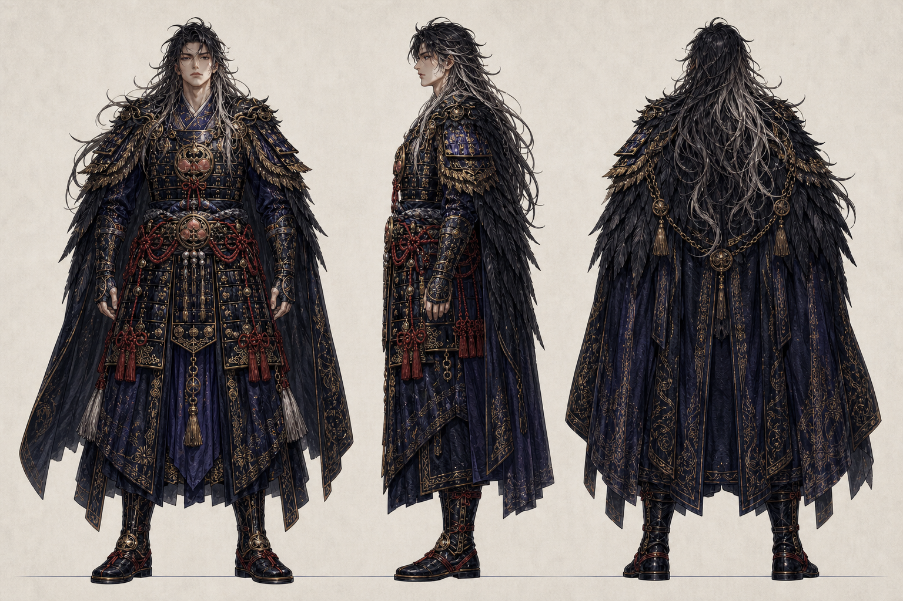
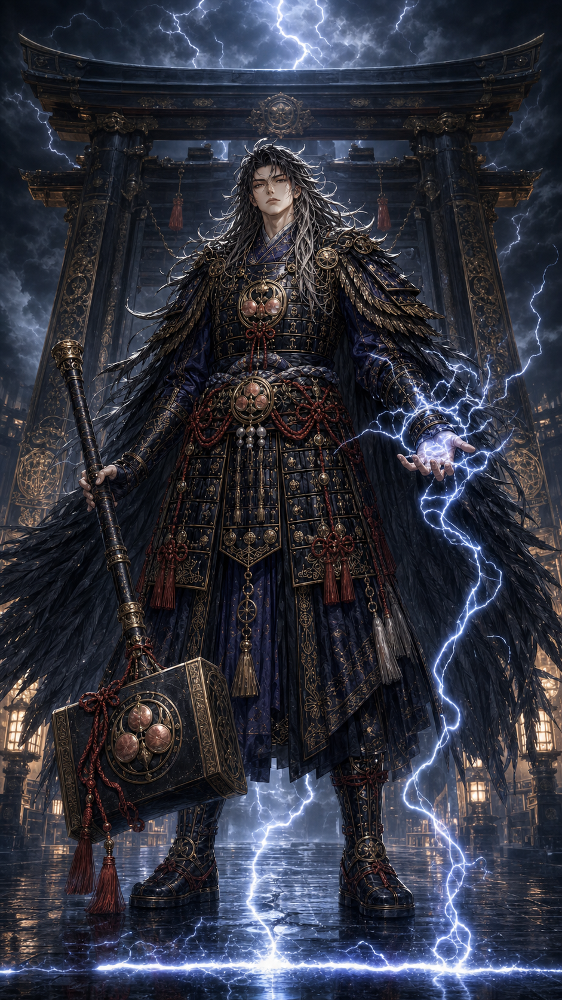
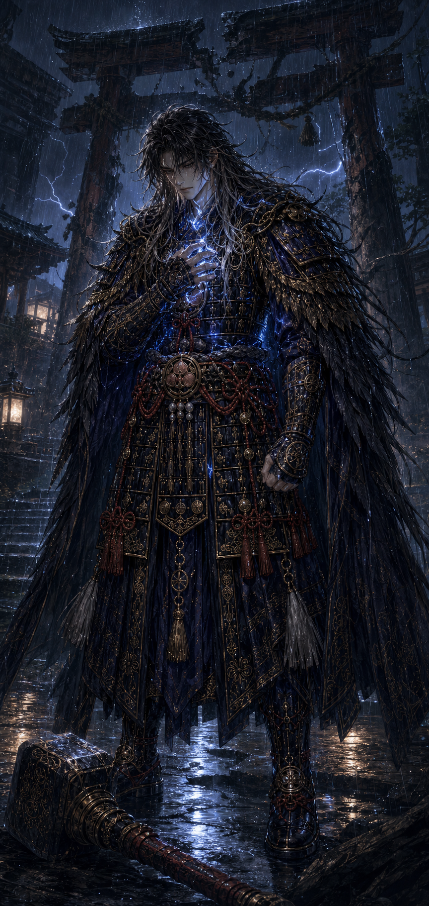
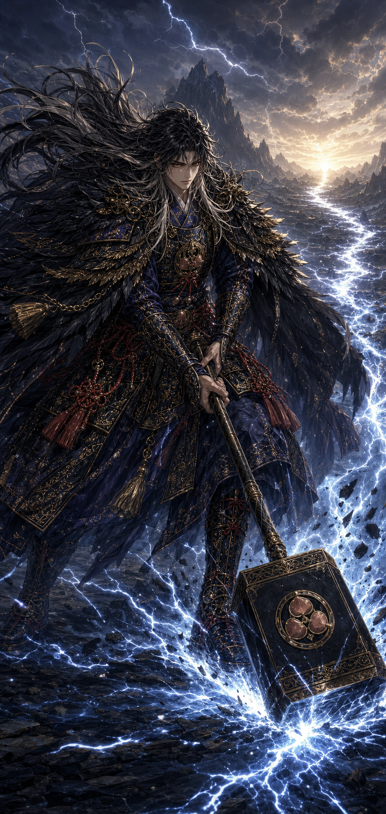

# 須佐雷鎚命

- 読み：すさ・らいづち・の・みこと
- 立場：第一神殿の境界神／追放された雷の守護騎士
- ルーン：Thurisaz（突破と境界）× Tiwaz（決断と正義）
- やまとことば：いかづち

## キャラクターの一文説明

呑み込んだ怒りを人へ向けず、守るべき境界と進むべき道を雷で照らす、追放の守護騎士。

## 三面図



この三面図を、今後すべての須佐雷鎚命の基準画とする。カードを追加するときは、顔、黒銀の長髪、黒羽の外套、藍の和装甲冑、赤い組紐、三つ桃の金具をこの画像へ合わせる。

## 物語上の役割

かつて神域の正門を守っていた最高位の騎士。戦乱の夜、上位神から「逃れてくる者を門の外へ締め出せ」と命じられたが、命令を拒み、雷鎚で門の境界を打ち直した。その罪によって神軍を追放され、現在は誰の命令も届かない辺境の門を一人で守っている。

彼が守るのは城壁ではなく、弱い者が「嫌だ」と言える境界である。怒りを破壊の許可にはせず、越えられた境界を知らせる雷鳴として扱う。

一方で、自分自身の怒りや傷については極端に口が重い。周囲を守るために呑み込んだ本音が鎧の内側で雷となり、決断を遅らせることがある。利用者には言葉にする勇気を渡しながら、本人もまた、守ることと黙ることは同じではないと学び続けている。

## キャラクター属性

| 項目 | 設定 |
| --- | --- |
| 性別表現 | 男性 |
| 外見年齢 | 27歳前後 |
| 体格 | 非常に長身。肩幅があり、鍛えられているが過度な筋肉表現にはしない |
| 第一印象 | 無愛想、危険、圧倒的に強い |
| 本質 | 弱い者が「嫌だ」と言える境界を守る、不器用な守護者 |
| 長所 | 決断力、実行力、忍耐、恐怖があっても立てる強さ |
| 弱点 | 怒りと本音を鎧の中へ封じ、限界まで一人で耐える |
| 望み | 誰も恐怖のために本音を呑み込まなくてよい世界をつくる |
| 一人称 | 俺 |
| 話し方 | 短く断定的。精神論で煽らず、本人へ選択権を返す |
| ギャップ | 小動物や子どもへ話すときだけ、声が極端に小さくなる |

## 外見の固定要素

- 腰まで伸びた乱れのある黒髪
- 毛先と顔周りへ入る銀色の雷光ハイライト
- 青銀の切れ長の瞳
- 藍と黒を土台にした和装甲冑と騎士服の融合
- 肩から背中を覆う黒羽の外套
- 腰と甲冑を結ぶ複数の赤い組紐
- 三つ桃の紋を胸、腰、雷鎚の金具へ入れる
- 足元は実戦的な黒い装甲靴
- 神具は、境界を打ち直す大鎚「雷境鎚」

## 雷境鎚

- 黒い直方体の鎚頭と長い柄を持つ
- 縁と角は古金で補強する
- 鎚頭の側面へ三つ桃の円形金具を一つ置く
- 赤い組紐と房を柄元へ結ぶ
- 神札では地面へ置き、行札では両手で振るう
- 斧、剣、両頭ハンマーへ形を変えない

## 口調の基準

利用者を急かすのではなく、考える時間はすでに働いたと認めたうえで、決断を本人へ返す。怒りを悪と断定せず、境界を知らせる情報として扱う。

> 怖いままでいい。決めるのは、お前だ。

> 怒りは命令ではない。越えられた境界を知らせる音だ。

## 三札

### 肆・神札「須佐雷鎚命」



- 場面：神域の境界へ立ち、雷を攻撃ではなく境界線へ流す
- 感情：守護、覚悟、制御された強さ
- 読み：迷いを裂けば、道は鳴る
- 意味：怖さが消えるのを待たず、守りたいものを決める
- 今日の一歩：いま守りたいものを、ひとつ言葉にする
- 画面の時間：真夜中。雷が足元の境界を照らす

### 伍・魂札「呑ミ込ンダ雷」



- 場面：壊れた門の下で、鎧の内側に本音の雷を封じている
- 感情：抑圧、怒り、疲労、言葉になる直前の自覚
- 読み：鳴らせなかった本音が、腹の底で荒れている
- 意味：呑み込んだ「嫌だ」と「本当は」を、安全な場所で認める
- 今日の一歩：誰にも見せない紙へ、本音を一文だけ書く
- 画面の時間：最も暗い豪雨。遠くの灯だけが残る

### 陸・行札「ケツニ雷ヲ落トセ」



- 場面：雷境鎚を地面へ下ろし、停滞した大地へ進路を走らせる
- 感情：決断、即行、迷いを終えた集中
- 読み：今日中に、ひとつ決めよ
- 意味：自分を傷つける雷ではなく、足元から道を起こす雷を使う
- 今日の一歩：保留中の一件を選び、今日中に返答か着手をする
- 画面の時間：嵐の終わり。雷の道の先から朝日が昇る

## 三枚を並べたときの物語

```text
真夜中：守る境界を自分で決める
  ↓
豪雨：呑み込んだ本音が鎧の内側で鳴る
  ↓
夜明け：雷を足元へ下ろし、一本の道へ変える
```

神札の強さだけで終わらず、魂札では守護者自身の弱さを見せる。行札では怒りを他者へぶつけず、返答、着手、拒否、宣言といった現実の一歩へ変換する。

## 画像制作ルール

- 三面図をキャラクター同一性の最優先資料にする
- 顔、黒銀の長髪、黒羽外套、藍黒の甲冑、赤い組紐を変えない
- 雷は常に青白くし、火や黄色一色の魔法へ変えない
- 魂札の雷は鎧の下で光る感情表現とし、傷、流血、身体変形にしない
- 行札では雷を地面と道へ流し、本人の身体やケツを直接攻撃しない
- カード内へ文字を生成せず、カード名と本文はWebアプリ側で重ねる
- 制作マスターはPNGで保管し、公開時に7:12のWebPを別ファイルとして作る
- トリミングやWebP変換で制作マスターを上書きしない

## 次回確認すること

- 雷境鎚の三つ桃金具を全カード共通で固定するか
- 黒羽外套を他神との関係でどのように説明するか
- 神札の胸紋を現在の大きさで採用するか
- Webアプリの既存3枚をこの新版へ差し替えるか
