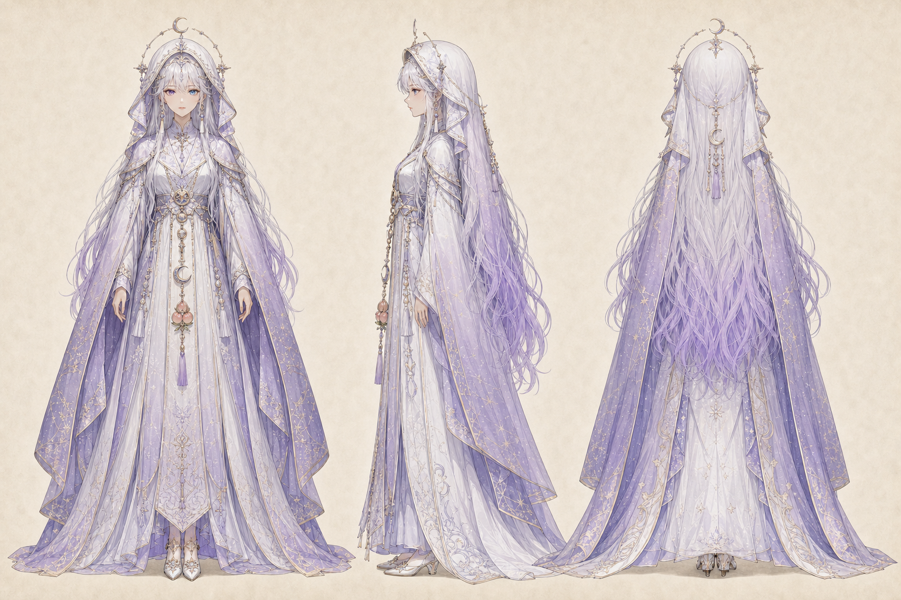
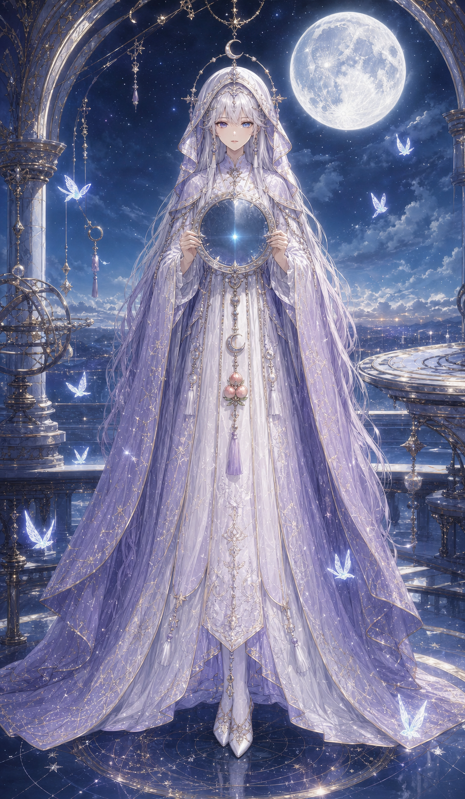
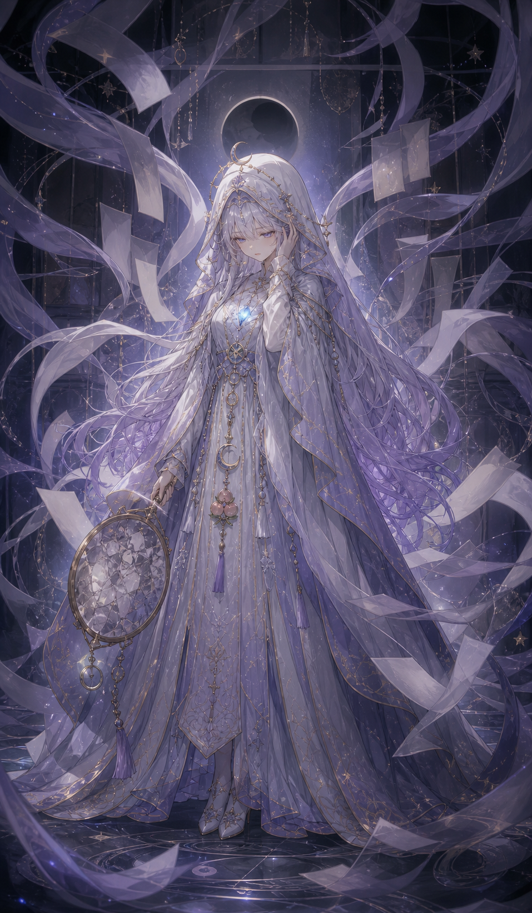

# 月白言依姫命

- 読み：つきしろ・ことよりひめ・の・みこと
- 立場：第一神殿の言霊神／銀月の予言姫
- ルーン：Perthro（秘められた可能性）× Ansuz（言葉と伝達）
- やまとことば：ことよせ

## キャラクターの一文説明

無数の未来の声から答えを選ばず、その人自身の内側にある最初の一言を見つける、銀月の予言姫。

## 三面図



## 物語上の役割

幼い頃から他人の願いと未来の断片が声として聞こえ、王都の月塔へ「正しい答えを告げる姫」として囲われていた。だが、あまりに多くの声を聞いたため、自分が何を望むのかだけが分からなくなった。

現在は未来を断定する預言をやめ、利用者がまだ言葉にできていない感覚へ静かな名前を渡す。正解を教える神ではなく、本音を本人へ返す神である。

## キャラクター属性

| 項目 | 設定 |
| --- | --- |
| 性別表現 | 女性 |
| 外見年齢 | 19歳前後 |
| 本質 | 答えを与えず、本人の本音が言葉になるまで待つ |
| 弱点 | 周囲の声を受け取りすぎ、自分の願いを後回しにする |
| 一人称 | わたし |
| 話し方 | 短く柔らかい。沈黙を恐れず、最後だけ核心を言う |
| ギャップ | 未来は読めるが、日常の道にはよく迷う |

## 外見の固定要素

- 銀白から藤色へ変わる非常に長い髪
- 薄紫と月青の左右異なる瞳
- 月白の神託姫ドレスと藤色のフード付き星読み外套
- 月と星の細い銀金装飾、三日月と三つ桃の胸飾り
- 神具は、他人の声と自分の声を分ける円形の「月読鏡」

## 三札

### 07・神札「月白言依姫命」



- 読み：言葉になる前の声を、月は知っている
- 意味：説明できない感覚を、偶然として捨てずに受け取る
- 今日の一歩：最初に浮かんだ言葉を、評価せず一文だけ書く
- 場面：月の観測殿で、曇りのない月読鏡を胸に持つ

### 08・魂札「百ノ声」



- 読み：聞きすぎた声の中で、自分が消えている
- 意味：期待、常識、助言を取り込みすぎ、本音が聞こえなくなっている
- 今日の一歩：今日だけ聞かない意見を、ひとつ決める
- 場面：月食の書庫で、文字のない声の帯に囲まれる

### 09・行札「ケツノ勘ヲ信ジヨ」


- 読み：最初の一言を、あとから消すな
- 意味：完全な根拠を待たず、小さく確かめる
- 今日の一歩：気になる方を一つ選び、五分だけ試す
- 場面：鏡を下ろし、一羽の銀鳥と月光の道へ踏み出す

## 三幕

```text
満月：内側の声を受け取る
  ↓
月食：他人の声に埋もれていると気づく
  ↓
明け方：最初の勘を、小さな一歩として試す
```

## 画像制作ルール

- 三面図の顔、銀藤の髪、異色の瞳、月白と藤の衣装を固定する
- 文字片は読める文章にせず、声の気配として描く
- 神託を断定する女王ではなく、静かな予言姫として描く
- 制作マスターを保持し、公開用7:12 WebPは別ファイルにする
