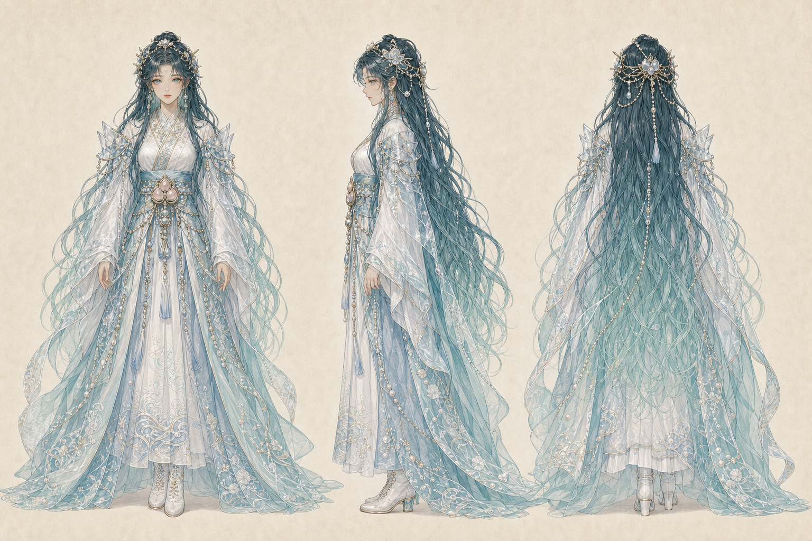

# 潮祓清瀬姫命

- 読み：しおばらい・きよせひめ・の・みこと
- 立場：第一神殿の浄化神／追放された水の聖女
- ルーン：Laguz（水と流れ）× Algiz（守護と境界）
- やまとことば：みそぎ

## キャラクターの一文説明

他人の苦しみを全部抱えるのではなく、持ち主へ返して流すことで、優しさと境界を両立させる水の聖女。

## 三面図



## 物語上の役割

人々の呪いを自分の身体へ引き受けて浄化していたため、神域の水を濁らせた罪で追放された聖女。追放後、浄化とは自己犠牲ではなく、不要なものを正しい持ち主と流れへ返すことだと学ぶ。

人を見捨てないが、頼まれたことを無条件で抱えない。休む、断る、返すという行為も、水を清く保つための神聖な仕事として教える。

## キャラクター属性

| 項目 | 設定 |
| --- | --- |
| 性別表現 | 女性 |
| 外見年齢 | 22歳前後 |
| 本質 | 優しい現実派。助ける範囲と本人の責任を分ける |
| 弱点 | 求められると境界を忘れ、すべて背負おうとする |
| 一人称 | わたし |
| 話し方 | 安心感のある柔らかさと、断るときの明快さを持つ |
| ギャップ | 浄化の聖女なのに、雨の日の泥遊びが好き |

## 外見の固定要素

- 青緑から海硝子色へ変わる非常に長い髪
- 淡い水色の瞳
- 白い聖女衣と水青の羽衣、波と真珠の刺繍
- 肩と腰の透明な水晶板、三つ桃の水紋飾り
- 神具は、受け取るものと返すものを分ける「潮境の水扇」

## 三札

### 10・神札「潮祓清瀬姫命」


- 読み：流すことは、見捨てることではない
- 意味：自分の水を清く保つことで、必要な助けを長く続けられる
- 今日の一歩：終わった感情や作業を、水と一緒に一つ流す
- 場面：泉と海の境で水扇を開き、濁りと清流を分ける

### 11・魂札「引キ受ケタ濁リ」


- 読み：その重さは、本当にあなたのものか
- 意味：他人の責任、感情、期待まで自分の荷物にしている
- 今日の一歩：抱えていることを「自分・相手・共有」に分ける
- 場面：借りた器を抱え、濁りが外衣へ染みていることに気づく

### 12・行札「他人ノケツマデ拭クナ」


- 読み：手伝うことと、代わりに背負うことを分けよ
- 意味：相手の成長まで奪わず、責任を正しい場所へ返す
- 今日の一歩：一件だけ、断る、返す、期限を相談する
- 場面：水扇の一振りで借りた濁りを器のある対岸へ返す

## 三幕

```text
晴れた朝：水の流れと境界を整える
  ↓
雨の夜：抱えた濁りが自分のものではないと気づく
  ↓
雨上がり：責任を返し、自分の清流を取り戻す
```

## 画像制作ルール

- 三面図の顔、青緑の髪、白水青の衣装、水晶板を固定する
- 濁りは感情の比喩とし、身体変形や汚物表現にしない
- 行札でもケツや掃除道具を直接描かない
- 制作マスターを保持し、公開用7:12 WebPは別ファイルにする
