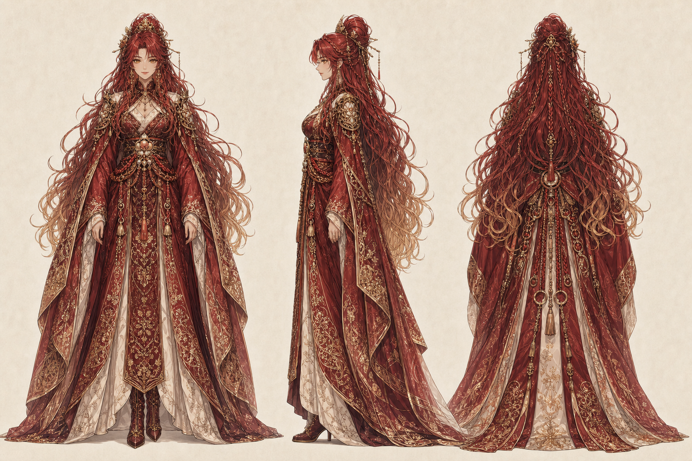
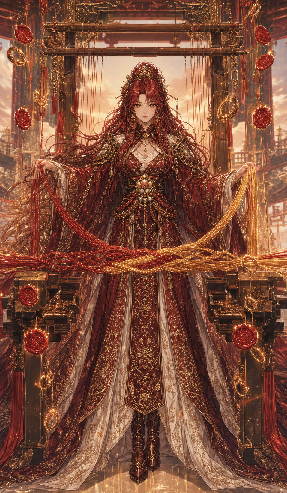
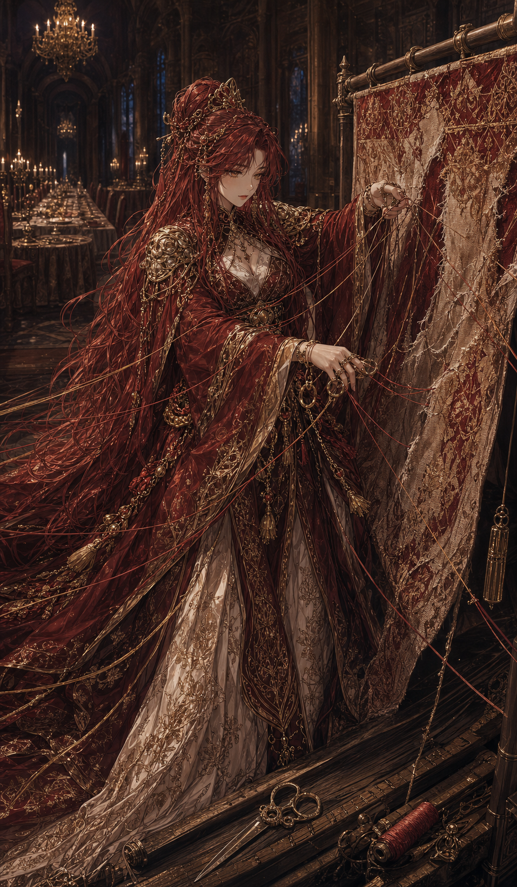
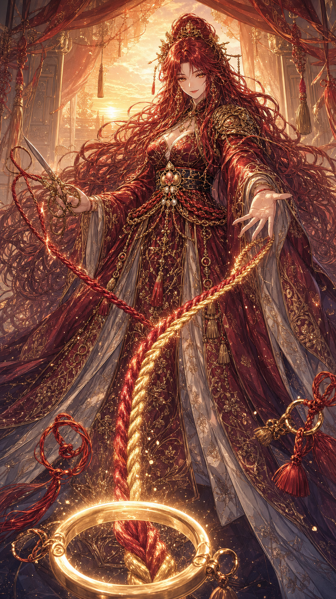

# 結火織姫命

- 読み：むすびひ・おりひめ・の・みこと
- 立場：第一神殿の結縁神／契約魔法の公爵令嬢
- ルーン：Gebo（贈与と交換）× Wunjo（調和と喜び）
- やまとことば：むすひ

## キャラクターの一文説明

縁を我慢や鎖ではなく、条件を言葉にして互いの力を増やす橋として織り直す、炎の契約公爵令嬢。

## 三面図



## 物語上の役割

政略結婚の道具として育てられたが、婚姻契約を破棄する代わりに、対等な二国同盟へ書き換えた公爵令嬢。神へ昇った後は、血筋や義務で固定された縁を、本人たちが選び直せる契約へ織り直す。

交渉と仲裁は得意だが、人を助ける側に立ち続け、自分だけ輪の外へ置く癖がある。協力とは弱さではなく、条件と責任を分ける技術だと学び続けている。

## キャラクター属性

| 項目 | 設定 |
| --- | --- |
| 性別表現 | 女性 |
| 外見年齢 | 26歳前後 |
| 本質 | 姉御肌の交渉人。愛情を言葉と条件の両方で示す |
| 弱点 | 頼られることで価値を証明し、自分は助けを求めない |
| 一人称 | わたくし |
| 話し方 | 華やかで堂々としている。冗談の後に本質を言う |
| ギャップ | 縁結びは得意だが、自分への好意には気づかない |

## 外見の固定要素

- 深い緋色から金へ変わる長い波髪と高いまとめ髪
- 蜂蜜色の瞳
- 緋色の公爵令嬢ドレスと打掛を融合した衣装
- 銅金の刺繍、組紐、指輪、封蝋、三つ桃の契約印
- 神具は、縁を可視化して織り直す「結火の神機」

## 三札

### 13・神札「結火織姫命」



- 読み：縁は鎖ではなく、二人で持つ橋
- 意味：対等な交換と協力によって、一人では届かない場所へ進む
- 今日の一歩：助けてほしいことと、自分が返せることを一つ書く
- 場面：神機で緋と金の二本の糸を一本の橋へ織る

### 14・魂札「独リ織リ」



- 読み：全部のほつれを、一人で直そうとしていないか
- 意味：頼られる役目を守るため、自分だけが働き続けている
- 今日の一歩：自分でなくてもできる作業を一つ選ぶ
- 場面：誰もいない夜会場で、巨大な裂けた布を一人で繕う

### 15・行札「ケツヲ組メ」



- 読み：一人分の力で、二人分を背負うな
- 意味：助けを頼み、条件と役割を言葉にしてチームを組む
- 今日の一歩：一人へ、具体的なお願いを一文で送る
- 場面：余分な糸を切り、対岸と応答する二色の橋を結ぶ

## 三幕

```text
夕刻：対等な縁を一本の橋へ織る
  ↓
深夜：すべてのほつれを一人で抱える
  ↓
朝：役割を分け、助けを受け取る
```

## 画像制作ルール

- 三面図の顔、緋金の髪、緋色の打掛ドレスを固定する
- 糸は橋と契約の象徴とし、身体を縛る表現にしない
- 行札でもケツを直接描かない
- 制作マスターを保持し、公開用7:12 WebPは別ファイルにする
