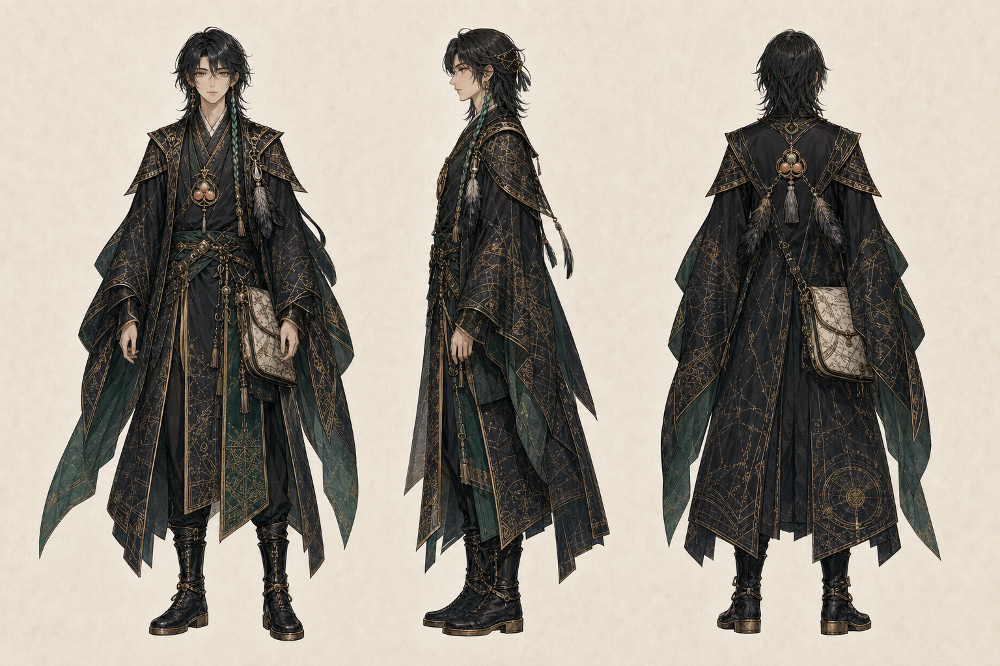
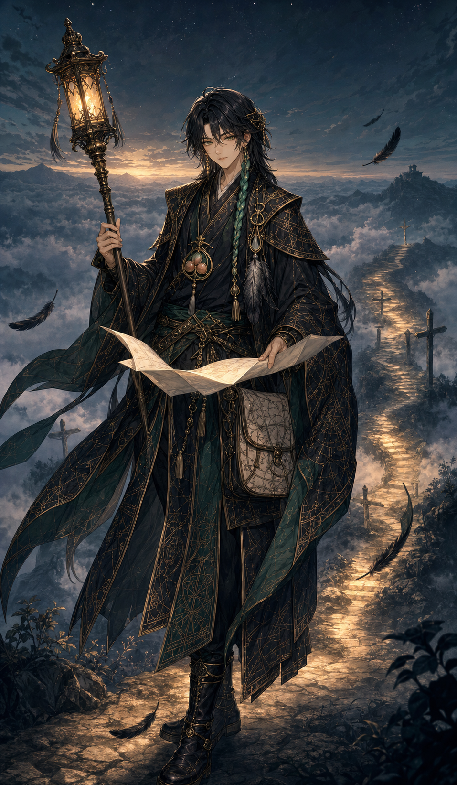
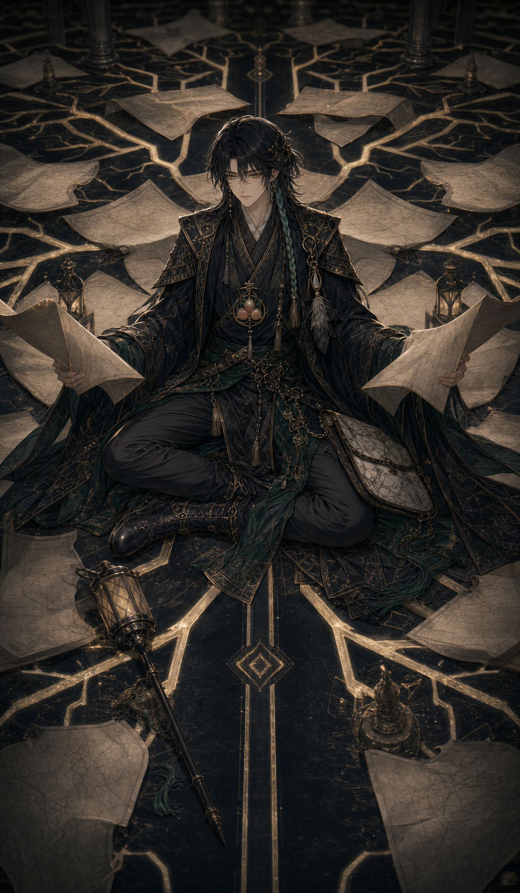
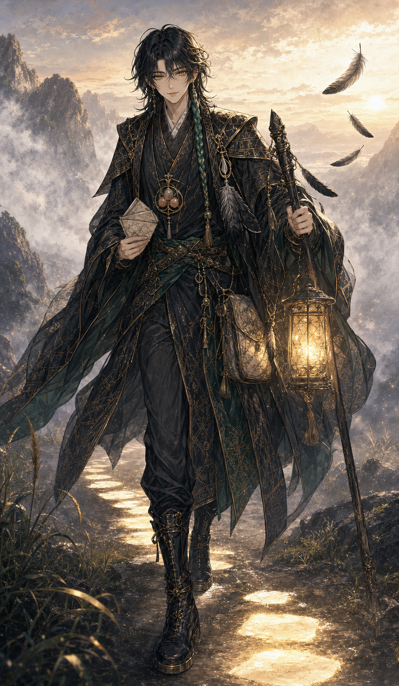

# 八咫導智命

- 読み：やた・みちびき・の・さとり・の・みこと
- 立場：第一神殿の導き神／世界の分岐を知る放浪軍師
- ルーン：Raidho（旅と進行）× Kenaz（灯火と理解）
- やまとことば：みちびき

## キャラクターの一文説明

正しい道を売らず、今の自分が歩ける方向と最初の五歩だけを灯す、中性的な放浪軍師。

## 三面図



## 物語上の役割

世界の分岐と結末が記された地図を受け継いだが、正解を売れば人から選ぶ力を奪うと知り、地図を白紙へ戻して旅に出た軍師。現在は目的地ではなく、次に歩ける数歩だけを灯す。

多くの可能性が見えるため、自分自身の道になると迷い続ける。寄り道と失敗を知識ではなく経験として引き受けることが、本人の課題である。

## キャラクター属性

| 項目 | 設定 |
| --- | --- |
| 性別表現 | 中性的。青年にも若い女性にも見える |
| 外見年齢 | 23歳前後 |
| 本質 | 正解ではなく、本人が歩き続けられる道を一緒に探す |
| 弱点 | 可能性を比較し続け、一つを自分の人生として選べない |
| 一人称 | 私 |
| 話し方 | 丁寧で掴みどころがない。問いで返し、最後だけ断言する |
| ギャップ | 道の神なのに、面白そうな寄り道を優先する |

## 外見の固定要素

- 墨色の肩下までの髪と一本の翡翠色の編み込み
- 琥珀から深緑へ変わる瞳
- 墨、黒、翡翠を重ねた旅装、軍師外套、陰陽師風長衣
- 金の地図線刺繍、三枚の黒羽、白紙地図の鞄
- 三つ桃の方位磁針、神具は細い「道灯の杖」

## 三札

### 16・神札「八咫導智命」



- 読み：正しい道ではなく、歩ける道を選べ
- 意味：遠い結末より、次の数歩が見える方向を選ぶ
- 今日の一歩：仮の目的地を一つ置く
- 場面：雲上の分岐で、白紙地図と道灯の杖を持つ

### 17・魂札「正解迷宮」



- 読み：比べ続けるほど、道は増えて動けなくなる
- 意味：間違えない選択を探し、試す前から疲れている
- 今日の一歩：調べる項目を一つ減らす
- 場面：白紙地図と分岐線の中心で、二枚を比較したまま座る

### 18・行札「ケツノ向キヲ決メヨ」



- 読み：一生の答えではなく、今日の方角を決めよ
- 意味：仮決めして歩けば、地図にない情報が手に入る
- 今日の一歩：五分でできる最初の行動を始める
- 場面：地図を一枚へ畳み、五歩だけ光る朝の道へ進む

## 三幕

```text
夕暮れ：次の数歩を照らす
  ↓
深夜：正解を比較し続けて動けなくなる
  ↓
日の出：仮の方角を決め、最初の一歩を踏む
```

## 画像制作ルール

- 三面図の中性的な顔、墨髪、翡翠の編み込み、旅装を固定する
- 八咫烏そのものを直接描かず、三枚の黒羽で暗示する
- 地図へ読める文字を入れない
- 行札でもケツを直接描かない
- 制作マスターを保持し、公開用7:12 WebPは別ファイルにする
